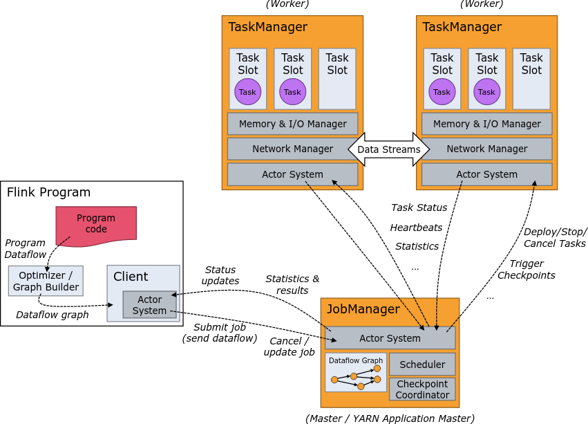
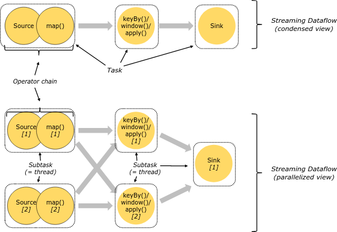
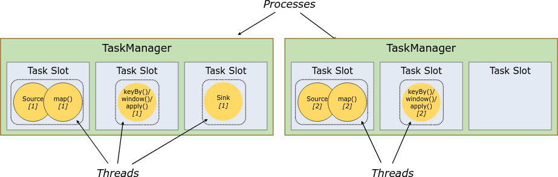

# Flink Components

* **The JobManager** is the master process that controls the execution of a single application
  * **ResourceManager**: Responsible for resource de-/allocation and provisioning in a Flink cluster
  * **Dispatcher**: REST interface to submit Flink applications
  * **JobMaster**: Managing the execution of a single
* **TaskManagers** are the worker processes of Flink

# Tasks and Operator Chains

* TaskManager provides slots(divided)
* Slots only divide memory
* One slot per task manager is full isolation
* More than one slot share jvm resources reduce per-task overhead
* Slot sharing
  * Parallelism=Number of slots(different sub-tasks may share slot)
  * Better resource utilization(map/flatmap do not get extra slot)

# Application Modes

## Session Mode
* Cluster shared by multiple jobs
* A job can crash cluster
* Good for small/short jobs,interactive queries
## Job Mode(Deprecate)
* Cluster per job
* A job can only crash its own cluster
* Long startup times
## Application Mode(Spark cluster mode)
* Application creates its own cluster
* A job can only crash its own cluster
* Long startup times

